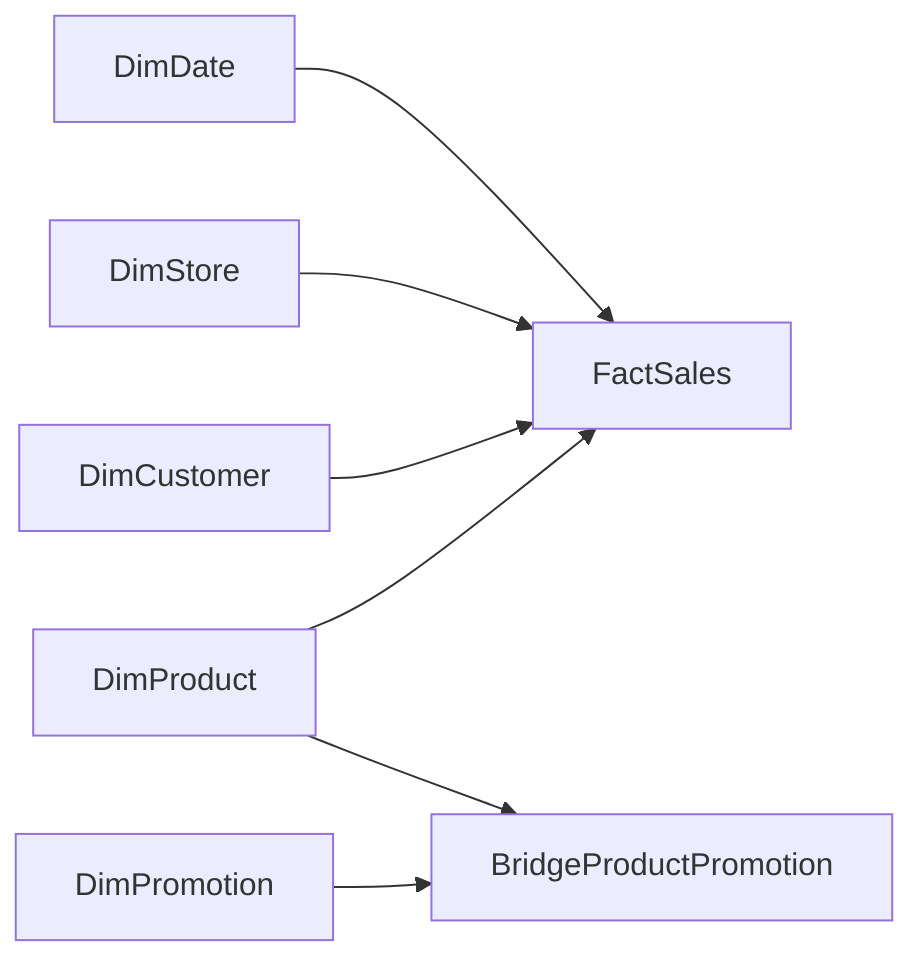

# Retail Promotion Analytics: Many-to-Many Done Safely

A compact Power BI portfolio case demonstrating data ingestion, data-quality controls, star-schema design, DAX and a non-trivial many-to-many relationship.

All companies, stores, customers, products and transactions are fictional. The dataset is deterministically generated with seed `5362026`; no personal or commercial data is used.

## Business question

Retail products can participate in several promotions, and each promotion covers many products. A direct join duplicates sales rows and overstates revenue. This project models the relationship through `BridgeProductPromotion` and provides two explicit attribution strategies:

1. **Unique-sales reach**: count each transaction once when analysing the combined selection of promotions.
2. **Allocated revenue**: split a product's revenue across its promotions using `AllocationWeight`, so total attributed revenue reconciles to total revenue.

The workbook preview also shows the intentionally wrong direct-join total and the amount of overstatement.

## Model



Relationships are one-to-many from dimensions to facts/bridge. Filtering promotions is handled in measures with `TREATAS`; bidirectional relationships are not required.

## Repository contents

- `data/incoming/`: synthetic CSV inputs, including six controlled data-quality exceptions.
- `src/generate_synthetic_data.mjs`: deterministic data generator.
- `power-query/`: staging, clean/reject split and dimension/bridge queries.
- `model/measures.dax`: business measures and safe promotion attribution.
- `model/model.md`: relationship configuration and modeling decisions.
- `Retail_Analytics_Demo.xlsx`: recruiter-friendly preview with formulas, charts and an audit sheet.
- `tests/validate_demo.mjs`: reproducibility and reconciliation checks.

## Reproduce

```powershell
node src/generate_synthetic_data.mjs
node tests/validate_demo.mjs
```

Then follow `POWER_BI_BUILD_GUIDE.md` to build the Power BI report. The `.xlsx` is a transparent preview, not a substitute for a `.pbix`; the Power Query and DAX source are kept as text so reviewers can inspect the implementation without proprietary binaries.

## What this demonstrates

- resilient CSV ingestion with explicit schema and type handling;
- rejected-row isolation instead of silent deletion;
- referential-integrity, duplicate-key and range checks;
- correct many-to-many modeling through a bridge table;
- DAX that controls filter propagation and prevents double counting;
- an auditable reconciliation between total and promotion-attributed revenue.
